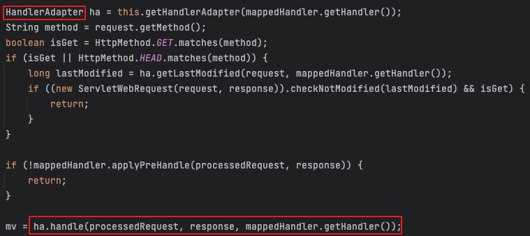

## 문제

```java
    public List<MemberGameResponse> findAllMemberGames(
            final Long loggedInMemberId,
            final Long memberId,
            final RegistrationStatus memberStatus
    ) {
        validateSelfMemberAccess(loggedInMemberId, memberId); // 1
        ... // 비즈니스 로직
    }

    public List<MemberGameResponse> findAllCreatedGames(final Long loggedInMemberId, final Long memberId) {
        validateSelfMemberAccess(loggedInMemberId, memberId); // 2
        ... // 비즈니스 로직
    }

    public GameMemberRegistrationStatusResponse findMemberRegistrationStatusForGame(
            final Long loggedInMemberId,
            final Long memberId,
            final Long gameId
    ) {
        validateSelfMemberAccess(loggedInMemberId, memberId); // 3
        ... // 비즈니스 로직
    }
```

제가 진행하고 있는 프로젝트에서는 위 코드처럼 **로그인 된 id**와 **클라이언트에서 조회하려고 넘겨준 id**가 동일한지 파악하는 검증 로직이 있습니다. 이렇게 비즈니스 로직이 아닌 코드가 서비스의 비즈니스 로직에 포함되어 사용되는 메서드의 개수가 최소 6개 이상이었고, 다른 클래스에서도 계속 사용되고 있었기 때문에 보기 좋지 않다고 생각했습니다.

또한 해당 로직은 권한에 대한 검증이기 때문에 서비스보다는 Presentation 영역에서 처리하는 것이 맞다고 생각이 들었고, 이것을 개선해보려고 합니다.

## 해결
처음에는 단순히 Presentation 영역인 Controller에서 사용되는 클래스마다 검증 메서드를 만들어서 처리하려고 했었습니다. 하지만 해당 로직을 작성해야하는 클래스가 여러개였고 똑같은 검증 메서드를 여러 곳에 중복되게 만들고 싶지 않았습니다.

그래서 저는 Custom Annotation과 Spring AOP를 이용해서 처리해보기로 했습니다. 하지만 Controller의 메서드에 AOP를 적용하는 것에 대해서 걱정되는 부분이 한가지 있었습니다.

```java

@Identification
@GetMapping("/{memberId}/created-games")
public ResponseEntity<List<MemberGameResponse>> findAllCreatedGames(
        @Login final Long loggedInMemberId,
        @PathVariable final Long memberId
) {
    return ResponseEntity.status(OK)
            .body(memberGameService.findAllCreatedGames(loggedInMemberId, memberId));
}
```

이 코드는 위에서 말씀드린 검증 로직이 적용되어야하는 Controller의 한 메서드입니다. 현재 메서드의 매개변수로 들어오는 값들이 `@Login`이나 `@PathVariable`로 들어오고 있기 때문에 해당 어노테이션의 기능이 동작하기 전에 `@Identification` 검증 로직이 수행된다면 매개변수에 들어간 loggedInMemberId와 memberId는 null 값으로 처리되어 정상적인 동작을 할 수 없게됩니다.

사실 `@Login`과 `@PathVariable` 어노테이션들의 동작시점은 무조건 `@Identification` 전 일 것으로 예상되긴하지만 궁금해서 찾아보았습니다.

**[DispatcherServlet의 동작과정]**


1. `@Login` 어노테이션 <br>
`@Login` 어노테이션은 ArgumentResolver를 통해 인가를 확인해주는 역할을 하며, 로그인된 사용자인지 검증합니다. 여기서 사용되는 ArgumentResolver는 위 그림 HandlerAdapter에서 동작합니다. HandlerAdapter의 역할로는 컨트롤러 전/후로 공통적인 전/후처리를 하는데 인터셉터를 포함해, @RequestParam, @RequestBody와 같은 것을 처리합니다.

2. `@PathVariable` 어노테이션 <br>
`@PathVariable` 어노테이션도 위와 마찬가지로 HandlerAdapter에서 컨트롤러 전에 처리되게 됩니다.
**[DispatcherServlet doDispatch 메서드]**
  
위 코드를 보면 HandlerAdapter를 가져와 ha.handle로 HandlerAdapter를 실행시키고 있는 것을 확인해볼 수 있습니다. HandlerAdapter는 인터페이스이기 때문에 구현체를 통해 실행되는데, 이때 `@PathVariable`은 PathVariableMethodArgumentResolver 클래스로부터 처리되고, `@Login`은 커스텀한 ArgumentResolver에 의해 처리됩니다.

3. `@Identification` 어노테이션 <br>
해당 어노테이션은 Spring AOP가 적용된 어노테이션으로 Spring AOP는 적용한 메서드의 전/후로 동작하게 됩니다. HandlerAdapter도 어찌보면 컨트롤러의 메서드가 동작하기 전/후로 처리되는 것이기 때문에 메서드의 전/후로 동작으로 볼 수 있지만 Spring AOP는 해당 클래스를 감싸고 있는 프록시 객체이기 때문에 HandlerAdapter보다 늦게 처리되는 것으로 볼 수 있습니다.

결국 제가 했던 걱정과 달리, AOP는 ArgumentResolver가 먼저 처리된 이후 동작하기 때문에 문제 없이 컨트롤러에서도 동작할 수 있습니다.

## 적용 코드

**Identification.java**
```java
@Retention(RUNTIME)
@Target({ElementType.METHOD})
public @interface Identification {

}
```

**IdentificationAspect.java**
```java
@Aspect
@Component
public class IdentificationAspect {

    @Before(value = "@annotation(Identification) && args(loggedInMemberId, memberId, ..)", argNames = "joinPoint, loggedInMemberId, memberId")
    public void checkIdentification(
            final JoinPoint joinPoint,
            final Long loggedInMemberId,
            final Long memberId
    ) {
        if (!loggedInMemberId.equals(memberId)) {
            throw new MemberException(MEMBER_MISMATCH, loggedInMemberId, memberId);
        }
    }
}
```

**MemberController.java**
```java
@Identification
@GetMapping("/{memberId}/games/{gameId}/registration-status")
public ResponseEntity<GameMemberRegistrationStatusResponse> findMemberRegistrationStatusForGame(
        @Login final Long loggedInMemberId,
        @PathVariable final Long memberId,
        @PathVariable final Long gameId
) {
    return ResponseEntity.status(OK)
            .body(memberGameService.findMemberRegistrationStatusForGame(memberId, gameId));
}
```

AOP를 이용하여 여러 클래스에서 중복된 메서드를 만들어 검증하지 않아도 되는 장점이 생겼습니다.