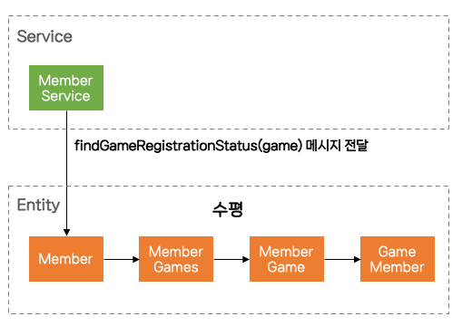
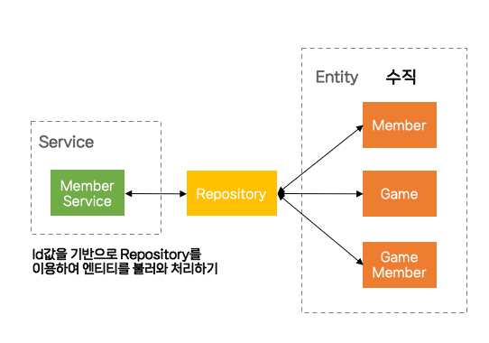
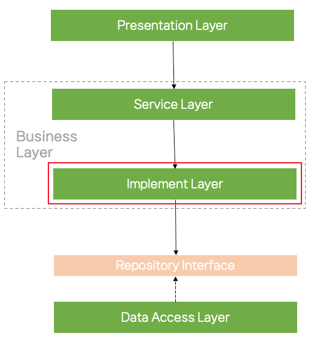

# 엔티티 간 연관 관계에 대한 고민

## 고민

프로젝트를 하며 엔티티 간 많은 연관 관계로 인해 아래와 같은 문제가 발생하여, 연관 관계를 맺는 것이 좋은 것인지 다시 고민해보게되었습니다.

## 고민 배경
### 1. Entity가 거대해진다.
**Member.class**
```java
@Entity
@Getter
@NoArgsConstructor(access = AccessLevel.PROTECTED)
@EqualsAndHashCode(of = "id", callSuper = false)
public class Member extends BaseEntity {

    ...

    @NotNull
    @ManyToOne(fetch = FetchType.LAZY)
    @JoinColumn(name = "address_depth1_id")
    private AddressDepth1 addressDepth1;

    @NotNull
    @ManyToOne(fetch = FetchType.LAZY)
    @JoinColumn(name = "address_depth2_id")
    private AddressDepth2 addressDepth2;

    @Embedded
    private MemberPositions memberPositions = new MemberPositions();

    @Embedded
    private MemberCrews memberCrews = new MemberCrews();

    @Embedded
    private MemberGames memberGames = new MemberGames();
  
    ...

    private void updateMemberPositions(final List<Position> positions) {
        memberPositions.updateMemberPositions(this, positions);
    }

    private void setDefaultIntroduction(final String nickname) {
        this.introduction = MessageFormat.format("안녕하세요. {0}입니다.", nickname);
    }

    public RegistrationStatus findCrewRegistrationStatus(final Crew crew) {
        return memberCrews.findCrewRegistrationStatus(crew);
    }

    public RegistrationStatus findGameRegistrationStatus(final Game game) {
        return memberGames.findGameRegistrationStatus(game);
    }

   ... 연관 관계 관련 메서드 10개 이상
}
```

위 Member 엔티티에 남겨져 있는 필드는 모두 연관 관계로 맺어진 필드입니다. 주로 Member의 경우 꽤나 많은 엔티티와 연관성이 있기 때문에 많은 연관 관계를 맺을 수 있습니다. 이렇게 Member와 같이 다른 엔티티와 연관 관계를 많이 맺을 경우 하나의 엔티티에 연관 관계를 위한 많은 메서드가 생성되고, 이는 한 엔티티에 많은 책임이 부여되며 거대해지게됩니다.

### 2. 코드가 수평으로 읽혀 가독성이 떨어진다.

**MemberSerivce.class**
```java
final RegistrationStatus memberRegistrationStatus = member.findGameRegistrationStatus(game);
```

이 메서드는 member가 매개변수로 들어가는 game에 등록된 상태를 확인하는 메서드 입니다. 위 메서드를 한 번 따라 가볼까요?

**Member.class**
```java
@Entity
public class Member extends BaseEntity {

    ...

    @Embedded
    private MemberGames memberGames = new MemberGames();
  
    ...

    public RegistrationStatus findGameRegistrationStatus(final Game game) {
        return memberGames.findGameRegistrationStatus(game);
    }

   ... 
}
```
game에 등록된 상태를 확인하는 로직인데, 저는 또 Embedded로 설정된 memberGames로 접근해서 확인해야합니다. 그럼 또 메서드로 타고 들어가볼까요?

**MemberGames.class**
```java
@Embeddable
public class MemberGames {

    @OneToMany(mappedBy = "member", cascade = {CascadeType.PERSIST, CascadeType.REMOVE}, orphanRemoval = true)
    private List<GameMember> memberGames = new ArrayList<>();

    public RegistrationStatus findGameRegistrationStatus(final Game game) {
        return memberGames.stream()
                .filter(memberGame -> memberGame.equalsGame(game))
                .findFirst()
                .map(GameMember::getStatus)
                .orElse(RegistrationStatus.NONE);
    }
}
```

드디어 game에 등록된 상태를 확인하기 위한 구현 코드를 확인해볼 수 있습니다. 근데 여기서 보면 또 연관 관계로 맺어진 memberGame에 접근하여 equalsGame이라는 메서드를 찾아야하고, 아래 반환된 결과 값인 GameMember에서 getStatus를 이용하여 결과 값을 반환 하는 것을 볼 수 있습니다.

물론 서비스에서 한줄로 호출하여 비즈니스 로직이 간단하게 읽힙니다. 또한 member 엔티티, 즉 도메인 안에 구현 코드를 숨김으로써 캡슐화가 된다고 볼 수도 있습니다.

하지만 코드를 읽기위해 `MemberService` -> `Member` -> `MemberGames` -> `MemberGame` -> `GameMember`의 흐름으로 따라가야하며, 이는 결국 하나의 비즈니스 로직을 구현하기 위한 코드를 한 곳에 모아서 보지 못하게되어 가독성을 떨어트리게 됩니다.

### 3. 연관 관계로 맺어진 Entity가 강결합되어 유지보수하기 어렵다.
`MemberService` -> `Member` -> `MemberGames` -> `MemberGame` -> `GameMember`

방금 2번에서 흐름을 따라간 것 처럼 결국 `Member`부터 `GameMember`까지 엔티티 간 강결합 되어있어 `GameMember`를 수정하는 경우 `MemberService` 까지 영향을 미치기 쉽습니다. 이렇게 될 경우 코드를 수평적으로 따라가며 읽기도 어려운데 하나를 고쳤을 때 연관된 엔티티를 모두 타고 들어가서 메서드를 수정해야하는, 유지보수가 어려운 상황에 처하게 됩니다.


## 해결
### 1. 연관 관계를 제거하고 연관 관계와 관련된 메서드를 걷어내어 서비스로 이동
**Member.class**
```java
@Entity
@Getter
@NoArgsConstructor(access = AccessLevel.PROTECTED)
@EqualsAndHashCode(of = "id", callSuper = false)
public class Member extends BaseEntity {

    ...

    @NotNull
    private Long addressDepth1Id;

    @NotNull
    private Long addressDepth2Id;

    ... 연관 관계 관련 메서드 삭제됨
}
```

`@OneToMany`로 연결되어있던 연관 관계들을 삭제하면서 관련 메서드가 삭제되었고, 엔티티의 책임이 가벼워졌습니다.

**MemberService.class**
```java
public GameMemberRegistrationStatusResponse findMemberRegistrationStatusForGame(
        final Long loggedInMemberId,
        Final Long memberId,
        final Long gameId
) {
    validateSelfMemberAccess(loggedInMemberId, memberId);

    final Member member = memberReader.readByMemberId(memberId);
    final Game game = gameRepository.getGameById(gameId);

    final GameMember gameMember = gameMemberRepository.findByMemberIdAndGameId(member.getId(), game.getId())
            .orElseThrow(() -> new MemberException(MEMBER_NOT_FOUND, member.getId(), game.getId()));

    return GameMemberRegistrationStatusResponse.of(gameMember.getStatus(), gameMember.isAlreadyReviewDone());
}
```

이전에 서비스에서 한줄로 끝나던 코드가 여러 줄의 코드로 늘어났습니다. 이 메서드에서는 member의 game 등록 상태를 알아보기 위한 구현 코드가 수직적으로 나열되있는 것을 볼 수 있습니다.

#### 변경 전


#### 변경 후


위 사진을 보면 변경 전에는 하나의 비즈니스 로직을 구현하기 위해 MemberService에서 관련된 메서드를 호출하면 엔티티를 수평으로 타고 들어가면서 데이터를 조회해오고, 변경 후에는 MemberService에서 Id값을 기반으로 Repository를 이용해 엔티티를 불러모아 관련된 구현 코드를 실행하는 수직적인 코드가 됩니다.

이렇게 하면 뿔뿔히 흩어진 구현 코드를 MemberService에 모아 하나의 비즈니스 로직을 처리하기 위한 구현 코드를 한 눈에 읽을 수 있습니다.
그 뿐만이 아니라 엔티티간 결합을 풀어 하나의 엔티티가 바뀌더라도 다른 엔티티가 변하지 않고 서비스에서 변경하면 돼서 변경에도 용이합니다.

하지만 제가 작성한 코드는 비교적 비즈니스 로직이 간단한 편에 속합니다. 만약 서비스에서 정말 복잡한 비즈니스 로직을 처리할 경우, Dto로 변환하기 위한 코드, Repository에서 데이터를 불러오는 구현 코드, 비즈니스와 관련된 코드들이 하나로 섞여 비즈니스 로직을 이해하기 어려워질 수 있고, 이번에는 서비스 계층의 역할이 커질 수 있게 됩니다.

### 2. 구현 계층을 도입



사진과 같이 구현 계층이 추가된 것을 볼 수 있습니다.

구현 계층의 역할은 기존 Service에서 비즈니스 로직을 수행하기 위해서 Repository에서 데이터를 불러와 데이터를 조합하거나, Dto 또는 Entity로 변환하기 위한 코드 등 구현을 위한 코드만을 모아놓는 계층입니다.
그렇게 되면 기존 서비스에서 비즈니스 로직과 구현 로직이 포함되어있던 코드를 분리하여 서비스 계층에서 복잡하고 커지는 코드를 또 하나의 계층으로 분리할 수 있습니다. 이렇게 하면 서비스 계층에서는 비즈니스 로직과 관련된 코드만을 작성하여 그 어떤 사람이 보더라도 비즈니스 로직의 흐름을 쉽게 파악할 수 있는 것이죠.


## 마지막으로
위와 같이 코드를 리팩토링하면서 확실히 더 읽기 쉬운 코드가 되었고, 유지보수하기 쉬워졌습니다. 물론 단점도 있습니다. JPA의 연관 관계를 사용하지 않으면서 객체 그래프 탐색을 하지 못하는 단점과 JPA의 편한 기능들을 사용하지 못한다는 것인데요. 저는 오히려 JPA와 같은 의존성을 너무 많이 의존하게되면 확장과 변경에 어려움이 생길 수 있다고 생각합니다. 소프트웨어를 만들 때는 물론 개발자가 특정 라이브러리에 의존하여 편하게 개발해야하는 것도 중요하다고 생각하지만, 그것보다 변경과 확장에 용이하고 유지보수가 편하며 지속적으로 성장할 수 있는 소프트웨어를 만드는 것이 더 중요하다고 생각합니다. 


