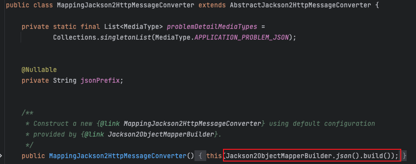

## 문제
Spring 서버에서 다른 게임사 서버로 API 요청시, 응답 값을 모두 null로 반환하는 문제가 발생했습니다.

**GameService.java**
```java
public void getMapleStoryMCharacterInfo(final String characterName, final String worldName) {
        final Ocid ocid = mapleStoryMRestTemplate.getCharacterOcid(characterName, worldName);
        final CharacterBasic characterBasic = mapleStoryMRestTemplate.getCharacterBasic(ocid.ocid()); // API 요청

        System.out.println(characterBasic);
    }
}
```


**MapleStoryMRestTemplate.java**
```java
public CharacterBasic getCharacterBasic(final String ocid) {
        return restTemplate.exchange(
                        createBasicApiUri(ocid),
                        HttpMethod.GET,
                        new HttpEntity<>(createHttpHeaders()),
                        CharacterBasic.class)
                .getBody();
}
```

**CharacterBasic.java**
```java
public record CharacterBasic(
        String characterName,
        String worldName,
        String characterDateCreate,
        ...
) {
}
```

위는 API를 요청하는 코드와 응답 객체이며 getCharacterBasic에도 응답 값에 대한 설정으로 CharacterBasic.class가 잘 들어가있습니다.


실제로 API를 요청시 위와 같이 요청 값에 대한 응답으로 모두 null 처리가 되는 것을 볼 수 있습니다.

## 문제 분석
**GameService.java**
```java
public void getMapleStoryMCharacterInfo(final String characterName, final String worldName) {
        final Ocid ocid = mapleStoryMRestTemplate.getCharacterOcid(characterName, worldName);
        final CharacterBasic characterBasic = mapleStoryMRestTemplate.getCharacterBasic(ocid.ocid()); // API 요청

        System.out.println(characterBasic);
    }
}
```
우선 위 코드에서 첫번째 API요청인 getCharacterOcid 메서드로 정상적으로 응답 값을 받아오는 것을 확인할 수 있었습니다. 

```java
public record Ocid(String ocid) {}
```

필드로 가지고 있는 값은 ocid 값 하나로 위에서 문제되었던 CharacterBasic 레코드와 특별히 다를 건 없었습니다. 


그래서 게임사 API 응답 값을 찾아보았는데 json의 key 값이 camelcase가 아닌 snakecase 형식으로 응답하고 있는 것을 확인해볼 수 있었습니다. 결국 ocid는 camelcase와 snakecase가 적용되지 않아 정상적으로 받아올 수 있었고, CharacterBasic안에 들어있는 값은 문자열 형태가 모두 camelcase로 json의 키 값과 형태가 달라 null값이 나오고 있던 것이었습니다.

## 해결

Spring 서버에서 외부 서버로 API 요청을 한 이후 응답을 받으면 일반적으로 json 형태로 데이터를 받게 됩니다. json 형태로 응답 받은 데이터는 Spring 서버에서 사용할 수 없기 때문에 json 형태의 데이터에서 자바 객체의 형태로 역직렬화해야합니다.

이때 이 과정을 도와주는 것이 MappingJackson2HttpMessageConverter입니다. 하지만 위에서 json의 키 값이 calmelcase가 아닌 snakecase가 적용되어있어서 데이터를 받지 못하고 있다고 언급했었습니다. 왜 자동으로 snakecase를 인식해서 처리하지 못할까요?

우선, HttpMessage를 변환할 때 사용하는 것은 MappingJackson2HttpMessageConverter가 맞으나, 실제로 json에서 자바 객체로 역직렬화할 때는 그 안에 사용되는 ObjectMapper를 이용해서 처리하게 됩니다.

**MappingJackson2HttpMessageConverter.java**


해당 자바 클래스를 확인해보면 기본 생성자로 생성시 Jacson2ObjectMapperBuilder.json().build()를 호출하는 것을 확인해볼 수 있습니다.

**Jackson2ObjectMapperBuilder.java**


호출하는 json() 메서드를 보게되면 별도의 설정 없이 객체를 생성해서 넘기는 것을 확인해볼 수 있습니다.


이때 중요한 것이 기본으로 객체를 생성할 때 필드에 있는 **PropertyNamingStrategy**인데, 이 필드 객체가 json안에 들어가는 key값을 어떤 형태로 지정해서 변환하겠냐는 설정 값입니다.

**PropertyNamingStrategies.java**


그래서 PropertyNamingStrategies 클래스에 들어가 주석을 확인해보니 Java 기본 설정으로 **LOWER_CAMEL_CASE**가 적용되어 있다는 것을 확인해볼 수 있었습니다.

> Naming convention used in Java, where words other than first are capitalized and no separator is used between words. Since this is the native Java naming convention, naming strategy will not do any transformation between names in data (JSON) and POJOS. Example external property names would be "numberValue", "namingStrategy", "theDefiniteProof".

> 자바에서 사용되는 명명 규칙으로, 첫 번째 단어가 아닌 다른 단어는 대문자로 표시되고 단어 사이에 구분자가 사용되지 않습니다. 이것은 기본 자바 명명 규칙이기 때문에, 명명 전략은 데이터(JSON)와 POJOS의 이름 사이에 어떠한 변환도 수행하지 않습니다.
예를 들어 외부 속성 이름은 "numberValue", "nameStrategy", "DefiniteProof" 등이 있습니다.

결국 문제가 되는 부분은 응답 받는 json의 데이터의 key 값이 snakecase로 들어오고 있는데, ObjectMapper의 기본 설정은 camelcase이었기 때문입니다. 저는 그럼 RestTemplate을 이용하여 HttpMessage를 변환할 때 기본 설정 값을 snakecase로 변경하면 되겠다 생각이 들었고 아래와 같이 변경하여 처리했습니다.

```java
@NoArgsConstructor(access = AccessLevel.PRIVATE)
public final class RestTemplateConfig {

    @Bean
    public RestTemplate restTemplate(final RestTemplateBuilder restTemplateBuilder) {
        return restTemplateBuilder
                .messageConverters(getSnakeToCamelMessageConverter()) // 기본 messageConverter 설정
                .setConnectTimeout(Duration.ofSeconds(5))
                .setReadTimeout(Duration.ofSeconds(5))
                .build();
    }

    private static MappingJackson2HttpMessageConverter getSnakeToCamelMessageConverter() {
        final ObjectMapper objectMapper = new ObjectMapper()
                .setPropertyNamingStrategy(SNAKE_CASE); // objectMapper를 생성하여 ProperyNaming 전략을 SNAKE_CASE로 변경

        final MappingJackson2HttpMessageConverter converter = new MappingJackson2HttpMessageConverter();
        converter.setObjectMapper(objectMapper); // 전략이 변경된 ObjectMapper를 새로운 MessageConverter에 적용 

        return converter;
    }
}
```

**적용 순서**
1. 새로운 ObjectMapper 생성하여 네이밍 전략을 snakecase로 변경
   - 프로젝트에서 사용하는 모든 API 요청 응답이 snakecase로 변경되어있어 네이밍 전략을 바꿔도 괜찮다고 생각했습니다.
2. 새로운 MappingJackson2HttpMessageConverter를 생성하여 1번에서 생성한 ObjectMapper를 적용
3. RestTemplate을 생성하여 Bean으로 올릴 때 기본 messageConverter를 새로 생성한 MappingJackson2HttpMessageConverter로 변경하여 적용

**RestTemplateBuilder의 messageConverters 메서드**


> Set the HttpMessageConverters that should be used with the RestTemplate. Setting this value will replace any previously configured converters and any converters configured on the builder will replace RestTemplate's default converters.

> RestTemplate와 함께 사용할 HttpMessageConverters를 설정합니다. 이 값을 설정하면 이전에 구성된 모든 변환기가 대체되고 빌드에서 구성된 모든 변환기가 RestTemplate의 기본 변환기를 대체합니다.

**적용 후**


적용 후 위 사진과 같이 데이터가 null이 아닌 정상 값으로 나오게 되었습니다.