# 중심 좌표로부터 특정 거리에 속하는 데이터 불러오기

## 1. 기능
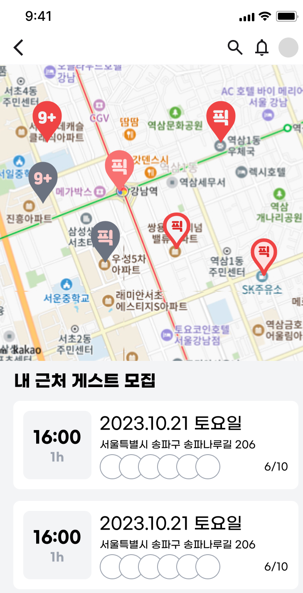

저희 프로젝트에서는 위 사진처럼 사용자의 **실시간 좌표** 또는 **특정 좌표**를 받아서 해당 좌표를 기준으로 특정 거리에 속하는 게스트 모집(경기) 글을 불러와야합니다. 좌표를 이용하여 특정 거리에 속하는 게스트 모집글을 불러오는 방법은 아래와 같이 **직각삼각형**과 **피타고라스의 정리**를 이용하면 됩니다.

### 1.1 두 좌표 사이의 거리 구하기 - 피타고라스 공식

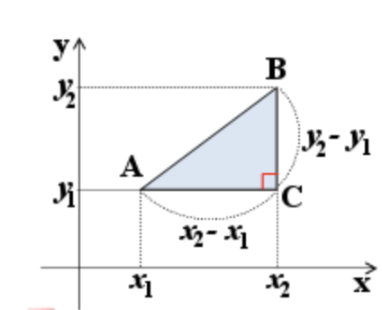

$$
\sqrt{(x_2-x_1)^2 + (y_2 - y_1)^2} = A와 B사이의 직선거리
$$

**(x2-x1)의 제곱  +  (y2-y1)의 제곱 → 루트로 나눈 값 = A와 B의 직선거리**

> **하지만 이렇게 계산 할 경우 무슨 문제가 생기는걸까요?**
> 

위의 식은 평면 위에서는 전혀 문제가 되지 않습니다. 하지만 위도, 경도는 지구를 기준으로 정해진 것이기 때문에 지구가 둥글다는 것을 고려해야합니다. 위의 식에 위도, 경도를 대입해도 충분히 가까운 거리는 오차가 크지 않을 수 있지만 두 좌표 사이의 거리가 멀어지면 멀어질 수록 지구의 곡률을 영향받아 오차가 커지게 됩니다.

### 1.2 두 좌표 사이의 거리 구하기 - 하버사인 공식

하버사인 공식은 **지구가 완전히 구형**이라고 가정하고 `경도`와 `위도`를 고려하여 구 위의 두 점 사이의 대원 거리를 결정하는 공식입니다. 위에서 얘기한 **피타고라스 공식을 이용한 두 좌표 사이의 거리 구하기를 극복할 수 있는 공식**인거죠. 하지만 지구는 완전한 구형이 아니기 때문에 아주 작은 오차는 있을 수 있습니다.


**하버사인 공식을 이용한 JPQL 쿼리 적용**

**GameRepository**

```java
public interface GameRepository extends JpaRepository<Game, Long> {

    String HAVERSINE_FORMULA = "(6371 * acos(cos(radians(:latitude)) * cos(radians(g.latitude)) *" +
            " cos(radians(g.longitude) - radians(:longitude)) + sin(radians(:latitude)) * sin(radians(g.latitude))))";

    Page<Game> findByAddressDepth1AndAddressDepth2(final AddressDepth1 addressDepth1, final AddressDepth2 addressDepth2,
            final Pageable pageable);

    @Query("SELECT g FROM Game g WHERE " + HAVERSINE_FORMULA + " < :distance ORDER BY " + HAVERSINE_FORMULA)
    List<Game> findGamesWithInDistance(@Param("latitude") double latitude, @Param("longitude") double longitude,
            @Param("distance") double distance);
}
```

**MySQL** **Query**

```sql
SELECT *
FROM Game 
WHERE 
(6371 * acos(cos(radians(37.4981646510326)) 
* cos(radians(latitude)) 
* cos(radians(longitude) 
- radians(127.028307900881)) 
+ sin(radians(37.4981646510326)) 
* sin(radians(latitude)))) < 3
ORDER BY 
(6371 * acos(cos(radians(37.4981646510326)) 
* cos(radians(latitude)) 
* cos(radians(longitude) 
- radians(127.028307900881)) 
+ sin(radians(37.4981646510326)) 
* sin(radians(latitude))));
```

위의 쿼리는 **강남역으로부터 3KM 이내**로 가장 가까운 게스트 모집글을 출력하는 쿼리입니다.

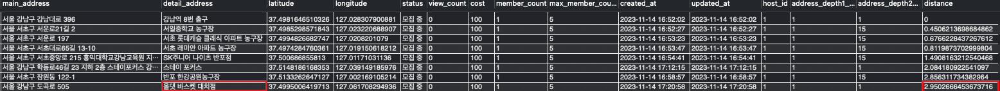

출력해보면 **`올댓 바스켓 대치점`** 의 경우 `강남역`과 약 `2.9KM`의 차이가 난다는 것을 확인해볼 수 있습니다. 그럼 네이버지도에서도 한 번 확인해볼까요?

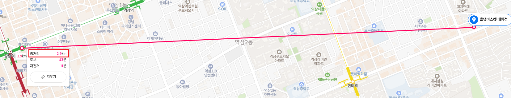

실제로 네이버지도에서 거리 측정을 해보아도 직선 거리가 `2.9km` 정도의 차이가 난다는 것을 확인해볼 수 있습니다.

> 그럼 위와 같이 MySQL 쿼리에 거리 계산하는 식을 넣어서 구현하고 클라이언트에서 좌표 값(위도, 경도)과 특정 거리(3KM)만 넘겨주면 서버에서는 출력되는 데이터만 넘겨주면 되겠네요?
> 

그렇게 해도 데이터가 출력되는 것은 전혀 문제가 되지 않지만, **항상 성능을 고려**해보아야합니다. 위에서 구현한 대로 쿼리 문을 날리게 될 경우 수학적 연산이 들어간 쿼리를 요청해야하는데 테이블의 모든 레코드를 읽어서 비교해야하기 때문에 성능적으로 굉장히 좋지 못합니다. 경기의 개수가 무수히 많아진다면? 정말 아찔하겠죠?

## 2. 성능 테스트 및 개선

그래서 위에서 구현한 기능을 점진적으로 개선해보고자 합니다.

### 2.1 MySQL Point 자료형 사용하기

**`double`** 타입인 `위도`, `경도` 컬럼, 그리고 하버사인 공식을 이용하여 조회할 때와 `point` 타입을 사용하여 MySQL 거리 관련 함수로 조회할 때의 성능 차이가 어느정도인지 또 어떻게 다른지에 대해서 이야기 해보도록 하겠습니다. 아래에서 나오는 테이블에는 더미데이터 **10000개**를 넣고 테스트했습니다.

**2.1.1 위도, 경도 double 컬럼을 사용 할 때**

위에서도 말씀드렸다시피 `위도`, `경도` 컬럼, 그리고 하버사인 공식을 이용하는 경우 MySQL 계산 함수를 통해 쿼리를 하게되는데 해당 쿼리가 테이블을 풀스캔 하다보니 데이터가 많으면 많아질 수록 속도가 느려질 수 밖에 없습니다. 매 레코드의 좌표 값과 특정 좌표 값과의 거리를 구하고 클라이언트에서 넘겨준 거리에 해당하는지 모두 확인해보아야하기 때문이죠.

**game 테이블**

```sql
CREATE TABLE IF NOT EXISTS `pickpledev`.`game`
(
		... 생략
    `latitude`          DOUBLE        NULL     DEFAULT NULL,
    `longitude`         DOUBLE        NULL     DEFAULT NULL,
		... 생략    
);
```

- game 테이블에 latitude와 longitude를 DOUBLE 형태로 값을 넣습니다.

**1KM 반경 내 조회 쿼리**

```java
SELECT *
FROM Game 
WHERE 
(6371 * acos(cos(radians(37.4981646510326)) 
* cos(radians(latitude)) 
* cos(radians(longitude) 
- radians(127.028307900881)) 
+ sin(radians(37.4981646510326)) 
* sin(radians(latitude)))) < 1
ORDER BY 
(6371 * acos(cos(radians(37.4981646510326)) 
* cos(radians(latitude)) 
* cos(radians(longitude) 
- radians(127.028307900881)) 
+ sin(radians(37.4981646510326)) 
* sin(radians(latitude))));
```

- game 테이블의 latitude와 longitude, 그리고 하버사인 공식을 이용하여 중심 좌표로부터 1KM 반경 내에 있는 game들을 불러옵니다.

**결과값**

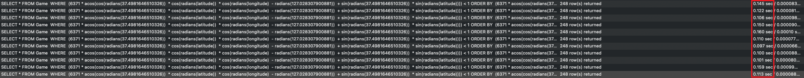

평균 duration: `0.125s`

**2.1.2 MySQL Point 컬럼과 공간 인덱스를 사용할 때**

**game 테이블**

```sql
CREATE TABLE IF NOT EXISTS `pickpledev`.`game`
(
		... 생략
    **`location`  POINT SRID 4326 NOT NULL,**
		... 생략    
		SPATIAL INDEX (location)
);
```

- game 테이블을 생성할 때 POINT 라는 공간 자료형으로 컬럼을 생성합니다.
- 이때 SRID 4326은 좌표의 측지계 즉, 지구의 공간정보의 위치와 거리를 나타내는 기준으로써 4326은 WGS84라는 의미합니다.
- SPATIAL INDEX로 공간 인덱스를 설정합니다.

**1KM 반경 내 조회 쿼리**

```java
SELECT id, main_address
FROM game
WHERE ST_Contains(ST_Buffer(ST_PointFromText('POINT(37.4981646510326 127.028307900881)',4326), 1000), location);
```

- game 테이블의 point 자료형과 MySQL 공간 관련 메서드를 이용하여 1KM 반경 내에 있는 game을 불러옵니다.
- **ST_Contains**: 한 Geometry가 다른 Geometry를 완전히 포함하는지 확인하는 함수
- **ST_Buffer**: 입력된 Geometry부터 지정된 거리만큼 Geometry를 둘러싸는 Geometry를 반환
- **ST_PointFromText**: 주어진 WKT(공간 정보)를 포인트 객체로 반환하는 함수

**결과 값**

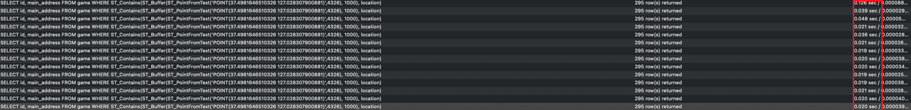

평균 duration: **`0.025s`**

**인덱스**

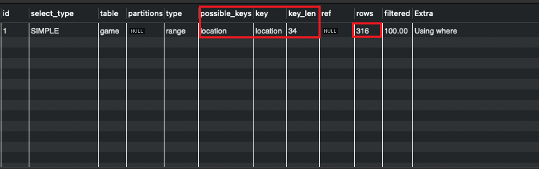


EXPLAIN 으로 확인시 공간 인덱스를 타는 것을 확인해볼 수 있습니다.

**결론**

MySQL의 공간 자료형과 공간 인덱스를 사용함으로써 `0.125`s → `0.025`s로 **약 5배 가량 쿼리 조회 성능 개선**

**2.1.3 번외**

**중심 좌표로 부터 1km 안에 있는 데이터 불러오기**

```sql
SELECT id, ST_AsText(location) as location,
ST_Distance_Sphere(location, ST_PointFromText('POINT(37.5 127.0)', 4326)) as distance
FROM game
WHERE ST_Distance_Sphere(location, ST_PointFromText('POINT(37.5 127.0)', 4326)) < 1000
ORDER BY distance;
```

위와 같이 ST_Distance_Sphere 함수를 이용해서도 거리 계산을 하여 불러올 수 있는데 이건 앞에서 위,경도 컬럼을 이용해서 체크하는 방식과 비슷하게 동작합니다.

**결과 값**

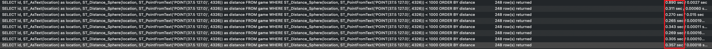

**평균 결과 값: 0.3s**

> 왜 공간 자료형을 사용하고 ST_Distance_Sphere 함수를 사용하면 그냥 일반 위,경도 컬럼을 이용해서 처리하는 것 보다 느릴까요?
> 

그것은 **ST_Distance_Sphere** 함수는 적용된 인덱스를 사용하지 못하기 때문입니다. 적용된 인덱스를 사용하지 못하더라도 성능이 비슷해야하지 않을까 싶은데요. 사실 공간자료형은 Blob형태로 저장되기 때문에 일반 형태의 Double로 저장하는 것 보다 성능상 이점을 가지지 못합니다.

### 2.2 fetch join을 통한 Lazy Loading N+1 문제 방지

위에서는 공간 자료형을 사용하여 쿼리를 최적화했습니다. 물론 5배나 빨라졌지만 실제로 어플리케이션 단계에서 동작할 때 생각보다 느려서 무엇이 문제인지 고민해보니 불필요한 쿼리가 굉장히 많이 날라가고 있었습니다. 아래는 현재 문제가 되는 코드입니다.

**Game**

```java
@Entity
@Getter
@NoArgsConstructor(access = AccessLevel.PROTECTED)
public class Game extends BaseEntity {

    @Id
    @GeneratedValue(strategy = GenerationType.IDENTITY)
    private Long id;

		... 생략

    @NotNull
    @ManyToOne(fetch = FetchType.LAZY)
    @JoinColumn(name = "host_id")
    private Member host;

    @NotNull
    @ManyToOne(fetch = FetchType.LAZY)
    @JoinColumn(name = "address_depth1_id")
    private AddressDepth1 addressDepth1;

    @NotNull
    @ManyToOne(fetch = FetchType.LAZY)
    @JoinColumn(name = "address_depth2_id")
    private AddressDepth2 addressDepth2;

    @Embedded
    private GamePositions gamePositions = new GamePositions();

    @Embedded
    private GameMembers gameMembers = new GameMembers();
		
		... 생략
}

```

- AddressDepth1, AddressDepth2, GamePositions, GameMembers 모두 FetchType이 Lazy로 설정되어있습니다.

**GameSearchRepository**

```java
@Repository
@RequiredArgsConstructor
public class GameSearchRepository {

    private final JPAQueryFactory jpaQueryFactory;

    public List<Game> findGamesWithInDistance(
            final Double latitude,
            final Double longitude,
            final Double distance
    ) {
        final String pointWKT = String.format("POINT(%s %s)", latitude, longitude);

        return jpaQueryFactory
                .selectFrom(game)
                .where(isWithInDistance(pointWKT, distance))
                .orderBy(getOrderByDistance(pointWKT))
                .fetch();
    }

    public BooleanExpression isWithInDistance(final String pointWKT, final Double distance) {
        return Expressions.booleanTemplate(
                "ST_Contains(ST_Buffer(ST_GeomFromText({0}, 4326), {1}), point)",
                pointWKT,
                distance
        );
    }

    public OrderSpecifier<Double> getOrderByDistance(final String pointWKT) {
        return Expressions.numberTemplate(
                        Double.class,
                        "ST_Distance_Sphere(point, ST_GeomFromText({0}, 4326))",
                        pointWKT
                )
                .asc();
    }
}
```

- 특정거리안에 있는 게임들을 불러올 때 findGamesWithInDistance 메서드를 호출하는데 해당 메서드 안에 join 없이 쿼리를 날리고 있는 것을 보실 수 있습니다.

**GameResponse**

```java
@Getter
@Builder
@AllArgsConstructor(access = AccessLevel.PRIVATE)
public class GameResponse {

	  ... 생략

    public static GameResponse of(final Game game, final List<MemberResponse> memberResponses) {
        return GameResponse.builder()
                .id(game.getId())
                .content(game.getContent())
                .playDate(game.getPlayDate())
                .playStartTime(game.getPlayStartTime())
                .playEndTime(game.getPlayEndTime())
                .playTimeMinutes(game.getPlayTimeMinutes())
                .mainAddress(game.getMainAddress())
                .detailAddress(game.getDetailAddress())
                .latitude(game.getPoint().getY())
                .longitude(game.getPoint().getX())
                .status(game.getStatus())
                .viewCount(game.getViewCount())
                .cost(game.getCost())
                .memberCount(game.getMemberCount())
                .maxMemberCount(game.getMaxMemberCount())
                .host(MemberResponse.from(game.getHost())) // lazy
                .addressDepth1(game.getAddressDepth1().getName()) // lazy 
                .addressDepth2(game.getAddressDepth2().getName()) // lazy
                .positions(game.getPositions())
                .members(memberResponses)
                .build();
    }
}
```

**MemberResponse**

```java
@Getter
@Builder
@AllArgsConstructor(access = AccessLevel.PRIVATE)
public class MemberResponse {

    ... 생략

    public static MemberResponse from(final Member member) {
        return MemberResponse.builder()
                .id(member.getId())
                .email(member.getEmail())
                .nickname(member.getNickname())
                .introduction(member.getIntroduction())
                .profileImageUrl(member.getProfileImageUrl())
                .mannerScore(member.getMannerScore())
                .mannerScoreCount(member.getMannerScoreCount())
                .addressDepth1(member.getAddressDepth1().getName()) // lazy
                .addressDepth2(member.getAddressDepth2().getName()) // lazy
                .positions(member.getPositions()) // lazy
                .build();
    }
}
```

findGamesWithInDistance 메서드를 통해 쿼리로 반환된 결과 값이 **GameResponse에 MemberResponse**가 포함되어 클라이언트한테 응답하는데요. 여기서 문제가 발생합니다. Lazy로 되어있는 Entity 객체에서 get으로 값을 불러올 때 select문을 호출하게 되는데 만약 조회되는 game이 100개라면 각각 lazy되어있는 필드마다 100번씩 호출되는 것이죠. 1개의 API를 요청하는데 select 쿼리가 100개 혹은 1000개가 나온다면.. 생각만 해도 끔찍합니다.


10만개의 더미 데이터를 넣고 특정 좌표를 기준으로 3KM 이내에 있는 API를 요청했을 때 응답 시간입니다. 평균적으로 `1.2초` ~ `1.8초` 사이로 나왔습니다.

이 것을 해결하기 위한 방법으로는 fetch join이 있습니다. sql에서 제공하는 조인은 아니고 JPQL에서 성능 최적화를 위해 제공하는 기능으로 연관된 엔티나 컬렉션을 한 번에 같이 조회하는 기능입니다.

**GameSearchRepository(fetch join 적용 후)**

```java
@RequiredArgsConstructor
public class GameSearchRepositoryImpl implements GameSearchRepository {

    private final JPAQueryFactory jpaQueryFactory;

    @Override
    public List<Game> findGamesWithInDistance(
            final Double latitude,
            final Double longitude,
            final Double distance
    ) {
        final String pointWKT = String.format("POINT(%s %s)", latitude, longitude);

        return jpaQueryFactory
                .selectFrom(game)
                **.join(game.host).fetchJoin()
                .join(game.addressDepth1).fetchJoin()
                .join(game.addressDepth2).fetchJoin()
                .leftJoin(game.gameMembers.gameMembers).fetchJoin()**
                .where(isWithInDistance(pointWKT, distance))
                .orderBy(getOrderByDistance(pointWKT))
                .fetch();
    }

		... **생략**
}
```

위와 같이 적용하여 game을 조회할 때 연관된 엔티티나 컬렉션을 모두 조회해옵니다. 이때 무조건 fetch join을 붙여서는 안됩니다! 만약 fetch join하는 테이블의 데이터를 실제로 사용하지 않는다면 불필요한 데이터까지 긁어오는 것이니까요!


위에서 했던 테스트랑 동일하게 10만개의 더미 데이터를 넣고 특정 좌표를 기준으로 3KM 이내에 있는 API를 요청했을 때 응답 시간입니다. 평균적으로 `0.3초` ~ `0.4초` 사이로 나왔습니다.

**결론**

해당 API에 대한 명세가 game이 가지고 있는 모든 연관 관계 데이터를 응답해야했기 때문에 fetch join을 해도 되는 상황이라 판단했습니다. 그렇게 fetch join을 적용 함으로써 적용 전 `1.2초` ~ `1.8초`에서 적용 후 `0.3초` ~ `0.4초`  **약 4배 정도 성능 개선**되었습니다. 

### 2.3 batch size 조절을 통한 N+1 문제 방지

**Game**

```java
@Entity
@Getter
@NoArgsConstructor(access = AccessLevel.PROTECTED)
public class Game extends BaseEntity {

    @Id
    @GeneratedValue(strategy = GenerationType.IDENTITY)
    private Long id;

		... 생략

    @NotNull
    @ManyToOne(fetch = FetchType.LAZY)
    @JoinColumn(name = "host_id")
    private Member host;

    @NotNull
    @ManyToOne(fetch = FetchType.LAZY)
    @JoinColumn(name = "address_depth1_id")
    private AddressDepth1 addressDepth1;

    @NotNull
    @ManyToOne(fetch = FetchType.LAZY)
    @JoinColumn(name = "address_depth2_id")
    private AddressDepth2 addressDepth2;

    @Embedded
    private GamePositions gamePositions = new GamePositions();

    @Embedded
    private GameMembers gameMembers = new GameMembers();
		
		... 생략
}

```

Game에 있는 GamePositions와 GameMembers는 여기에 적혀있진 않지만 `@OneToMany`로 연관 관계를 맺고 있습니다. `@ManyToOne`처럼 fetch join을 여러개 할 수 있다면 좋겠지만 `@OneToMany`로 이루어진 필드의 경우 Hibernate의 PersistenceBag으로 이루어져있기에 여러개로 fetch join이 불가능합니다. [참고](https://github.com/Hchanghyeon/dev-troubleshooting/blob/main/%5B%EC%98%88%EC%99%B8%5D%20Fetch%20%EC%A1%B0%EC%9D%B8%EC%8B%9C%20%EB%B0%9C%EC%83%9D%ED%95%98%EB%8A%94%20MultipleBagFetchException%20%ED%8A%B8%EB%9F%AC%EB%B8%94%20%EC%8A%88%ED%8C%85.md)

그래서 `@OneToMany`가 2개 이상인 엔티티의 경우 1개만 fetch join을 걸 수 있고 나머지는 batch size 조절을 통하여 N+1 문제를 방지할 수 있습니다.

> **batch size란?**
> 

batch size는 JPA에서 성능 개선을 위한 옵션 중 하나로 다수의 프록시 객체를 조회할 때 WHERE 절이 여러개의 SELECT 쿼리들을 하나의 IN 쿼리로 만들어서 질의할 수 있게 해줍니다. 만약 game을 조회했는데 gamePositions의 size가 10이라면 10번 쿼리를 날려야하는데 이것을 IN으로 묶어서 쿼리를 보내주게 되는 것이죠!

**GamePositions**

```java
@Embeddable
public class GamePositions {

    **@BatchSize(size = 1000)**
    @OneToMany(mappedBy = "game", cascade = {CascadeType.PERSIST, CascadeType.REMOVE}, orphanRemoval = true)
    private List<GamePosition> gamePositions = new ArrayList<>();

	  ... 생략
}
```

위 처럼 `@BatchSize(size = 1000)`지정해주시면 size를 지정한 만큼 IN 쿼리 안에 들어가게 됩니다. 저는 실제로 매 요청시마다 나오는 데이터가 많다고 가정하고서 진행했기 때문에 1000으로 했지만 상황에 따라서 유동적으로 바꿔주시는게 좋을 것 같습니다. 

**적용 후 쿼리**

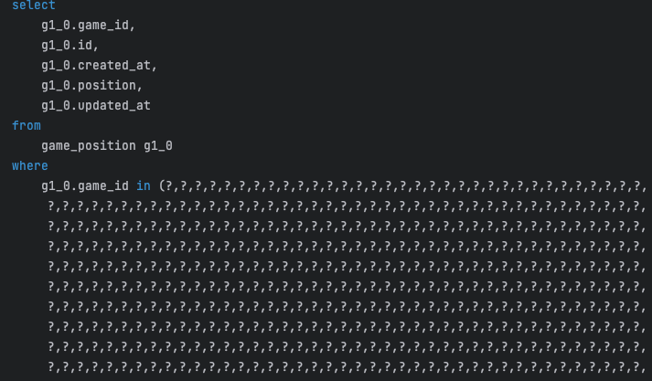

### 2.4 성능 개선 후기

예전에는 기능을 구현하기만 하면 된다고 생각했는데 수 많은 요청과 크고 많은 데이터들 때문에 최적화하는 것이 필수가 된 것 같습니다. 찾아보니 생각보다 최적화 할 수 있는 방법은 많았고 실제로 최적화 하기전과 최적화 한 후의 결과 값을 보니 최적화하면 성능적으로 정말 많이 좋아지고 중요하다는걸 많이 느끼게되었습니다.

## 기타

개발 관련 오픈 채팅 톡방에서 어떤 분께서 Point 관련된 내용으로 질문하셨었는데 때 마침 공부를 끝내고 적용을 마친상태라 제가 도와드릴 수 있을 것 같아 개인 오픈 톡방으로 옮겨 질문자 분께 질문을 받았습니다.


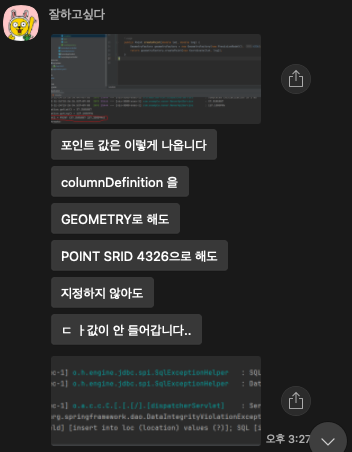
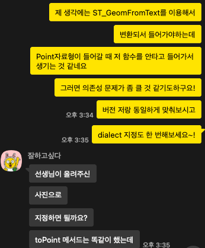


Point 자료형에 대한 insert가 안된다고 하셨었는데 에러 메시지를 보니 ST_GeomFromText를 이용해서 변환되지 않고 들어가는 문제 같았습니다. 해당하는 MySQL 메서드를 이용하기 위해서는 그에 맞는 dialect를 적용하고 해당 메서드가 지원되는 hibernate 의존성을 추가해야될 것 같아서 의존성 버전과 dialect를 맞춰달라고 말씀드렸고 그 결과 정상적으로 돌아가신다고 하시네요! 확실히 제가 모르는 것을 배우고 그것을 또 모르는 사람에게 알려주는 일은 정말 보람차고 즐거운 일 같아요 👍👍

