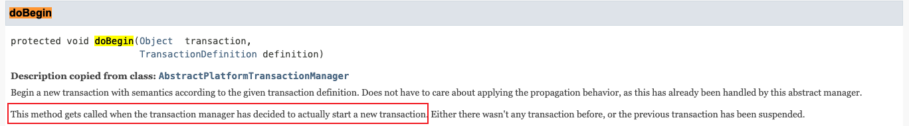
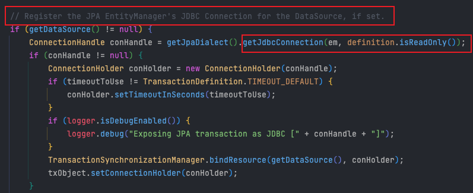

## 1. 문제 상황


```java
    private void saveGameCharacterSearchLog(
            final GameType gameType,
            final String worldName,
            final String characterName
    ) {
        final GameCharacterSearchLog gameCharacterSearchLog = GameCharacterSearchLog.builder()
                .gameType(gameType)
                .worldName(worldName)
                .characterName(characterName)
                .build();

        applicationEventPublisher.publishEvent(gameCharacterSearchLog); // 비동기 이벤트로 DB에 검색 이력 저장

        final CharacterInfo characterInfo = CharacterInfo.builder()
                .worldName(worldName)
                .characterName(characterName)
                .build();

        applicationEventPublisher.publishEvent(new RankingDataSave(gameType, characterInfo)); // 비동기 이벤트로 Redis에 캐릭터 랭킹 데이터 저장
    }
```
저는 프로젝트에서 위와 같이 비동기 이벤트를 이용하여 DB와 Redis에 각각 데이터를 저장하는 로직을 구현해두었습니다. 위 처럼 구현한 이유는 원래 해당 API의 기능은 모바일 게임 캐릭터의 데이터를 외부 API로부터 불러와서 보여주는 것이 중요한 로직이기 때문에, 의존성을 이벤트와 비동기로 분리함으로써 DB가 죽어도, Redis가 죽어도 중요한 캐릭터 조회 서비스는 실행되도록 말이죠.

### 1.1 DB 저장 로직
```java
@Slf4j
@Component
@RequiredArgsConstructor
public class GameCharacterSearchLogSaveHandler {

    private final GameCharacterSearchLogRepository gameCharacterSearchLogRepository;

    @Async
    @EventListener
    @Transactional
    @Retryable(
            retryFor = Exception.class,
            maxAttempts = 5,
            backoff = @Backoff(delay = 3000, multiplier = 1.5, maxDelay = 10000),
            listeners = "retryHandler"
    )
    public void saveGameCharacterSearchLog(final GameCharacterSearchLog gameCharacterSearchLog) {
        gameCharacterSearchLogRepository.save(gameCharacterSearchLog);
        log.info("game character search log saved : {}", gameCharacterSearchLog.getCharacterName());
    }
}
```

### 1.2 Redis 저장 로직
```java
@Slf4j
@Component
@RequiredArgsConstructor
public class GameRankingDataSaveHandler {

    private final GameRankingRedisRepository gameRankingRedisRepository;

    @Async
    @EventListener
    @Transactional
    @Retryable(
            retryFor = Exception.class,
            maxAttempts = 5,
            backoff = @Backoff(delay = 3000, multiplier = 1.5, maxDelay = 10000),
            listeners = "retryHandler"
    )
    public void gameRankingDataSave(final RankingDataSave rankingDataSave) {
        gameRankingRedisRepository.createOrIncrementScore(rankingDataSave.gameType(), rankingDataSave.characterInfo());
        log.info("game rank data saved : {}", rankingDataSave.characterInfo().characterName());
    }
}
```

위 2가지 저장 로직은 이벤트리스너를 통해 publish하면 subscribe하고 있는 핸들러에서 데이터를 받아 처리하게 됩니다. 두 가지 로직 모두 실패에 대비해 @Retryable을 이용했고, 트랜잭션을 통해 잘못되었을 때 데이터가 롤백될 수 있도록 처리했습니다.

그래서 정상적으로 동작하는지 확인해보기 위해 아래와 같이 테스트해보았습니다.

### 1.3 테스트 상황
1. SpringBoot로 서버를 가동
2. DB를 Down 시킴
3. 해당 API를 요청

#### 1.3.1 예상 결과
- 우선 사용자에게 모바일 캐릭터 조회 결과는 응답하고, DB와 관련된 저장은 Retry를 계속 지속하며 병렬적으로 Redis에 데이터가 저장됨

#### 1.3.2 실제 결과(문제 상황)
- 모바일 캐릭터 조회 결과를 응답하고, DB와 관련된 저장을 계속 Retry를 하지만 병렬적으로 Redis에 저장하는 로직이 작동하지 않는 현상

#### 1.3.3 예상 문제
- 비동기로 돌아가는 2개의 이벤트 로직이 병렬적으로 워커쓰레드에 의해 나눠서 실행되는 것이 아닌 동기적으로 돌아가는 현상. 즉, 하나의 쓰레드에 의해 처리되는 문제

위와 같이 실제로 예상했던 결과와 다르게 나오게 되었고 예상 문제를 테스트하기위해 현재 쓰레드의 이름을 log로 찍어 확인해보았으나 같은 쓰레드로 동작하지 않고 있었습니다. 그럼 무엇이 문제일까요?

답은 Redis에 @Transactional을 붙인게 원인이었습니다.

## 2. @Transactional
왜 Redis에 트랜잭션을 붙이면 운영중인 DB가 끊어졌을 때 문제가 생기는걸까요?

### 2.1 @Transcational 동작 방식
우선 @Transactional을 사용할 때 여러가지(다형성) PlatformTransactionManager에 의해 트랜잭션이 동작할 수 있습니다. 저의 경우 JPA를 사용하기 때문에 현재는 JpaTransactionManager가 동작한다고 볼 수 있고 PlatformTransactionManager에 다른 DB를 위해 추상화 되어있습니다. TransactionManager는 트랜잭션의 기능들을 잘 활용하기 위해 미리 만들어놓고 관리하기 위한 용도로 사용되는 클래스라고 생각하시면 됩니다.


1. TransacionInterceptor가 실행되면서 @Transaction으 AOP로직을 수행 함(TransactionInterceptor는 TransactionAspectSupport를 상속받고 있음)
   
2. 사용하는 DB 기술에 따라 PlatformTransactionManager의 구현체를 불러와서 로직을 수행시킴

3. 이때 getTransaction()을 호출하게되는데 이 메서드를 타고 들어가보면 실제로 doBegin이라는 메서드가 사용되는 것을 확인해볼 수 있음

#### JpaTransactionManager의 doBegin()

- doBeigin 메서드는 실제로 트랜잭션을 생성해야할 때 호출되는 메서드

- 해당하는 부분을 보면 getJdbcConnection을 불러오는 코드가 있음

뒷 부분의 로직도 더 있지만 현재 제가 겪고있는 문제와는 상관이 없는 내용이기에 적지 않겠습니다.


### 2.2 원인 파악
알고보니 @Transactional을 사용하게되면 기본적으로 트랜잭션을 새로 생성하기 위해 커넥션을 가져다가 사용해야하는데 테스트를 하기 위해서 DB를 내렸을 때 정상적으로 커넥션을 불러오지 못해서 발생하는 문제였었습니다. 사실 기본적인 내용일 수 있는데 예측하지 못했었습니다.

### 2.3 해결 방법
사실 Redis 자체로만 보면 트랜잭션은 지원하지 않고 있기 때문에 예외가 발생했을 때 자동으로 롤백해주는 기능이 없습니다. RedisTemplate을 생성할 때 setEnableTransactionSuuport(true) 설정을 하게 되면 새로운 transactionManager를 만들어서 트랜잭션 기능을 사용할 수 있게 됩니다. 하지만 결국 구현체로 사용하는 클래스가 DB에 종속적인 클래스가 되어 사용하기 어려운 문제가 있습니다.

현재 저의 코드에서는 복잡한 비즈니스로 저장하는 것이 아닌 단순히 저장하는 로직 하나만 있기 때문에 저장 후 예외가 발생할 수 있는 부분이 없을 것이라 판단되어 @Transactional을 삭제하는 것으로 처리했습니다.

만약 이 부분을 예외가 발생했을 때 롤백해야한다고하면, 직접 코드로 try catch하여 데이터를 바로 삭제하는 방식으로 처리해야할 것 같습니다.


## 3. 결론
- @Transactional은 DB Connection에 의존적이다.
- Redis 자체는 트랜잭션을 지원하지않기 때문에 RedisTemplate 설정시 지원해주는 트랜잭션 방식을 이용해야한다.
