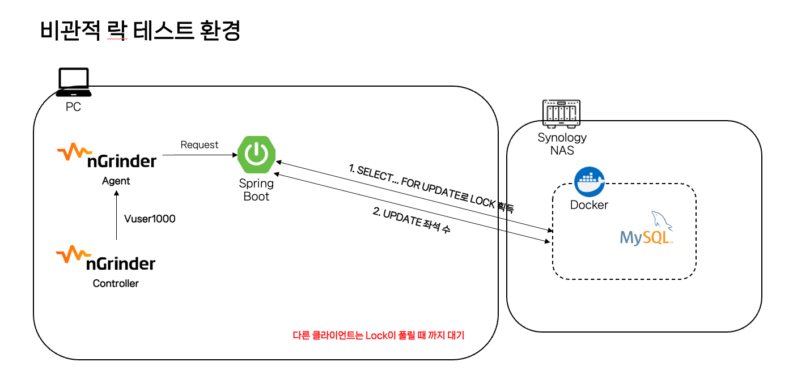
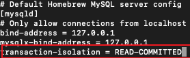

# 공연 예매시 발생하는 좌석 동시성 문제 해결하기

저희 프로젝트는 인터파크와 같은 티켓 예매 사이트로써 많은 사용자가 동시에 사이트에 접근하여 예매하는 경우가 많습니다. **동시에 예매하는 것이 어떠한 문제를 일으키는 것일까요?**

## 1. 문제

>❗ 예를 들어 봅시다. 
>
> 10월 18일 18시에 고척 돔에서 방탄소년단의 공연이 있다고 가정해봅시다.
> 
> 이 티켓은 오늘 18시부터  예매할 수 있고 따로 좌석이 없고 스탠딩으로 이루어져 있어 먼저 구매한 순으로 앞자리부터 이용할 수 있다고 합니다. 그럼 오늘 18시에 열리는 사이트는 굉장히 많은 사람이 한꺼번에 몰려서 예매를 시도하겠죠?
> 이것을 개발 관점으로 다시 보게 되면 18시에 사용자들이 동시에 예매를 하는 경우 해당하는 공연에 대한 좌석 수에 동시에 접근하여 좌석 수를 감소시킬 수 있다는 점입니다. 좌석 수라는 공유된 자원에 여러 명이 접근하여 읽거나 쓰려고 하는 Race Condition이 발생할 수 있는 것이죠.

위에서 든 예처럼 저희 프로젝트에서는 **Race Condition**이 일어날 수 가능성이 아주 큽니다.

그럼 성능 테스트 도구를 이용해서 가상으로 1**000명의 사용자가 있다고 생각하고 동시에 예매 API를 호출**해보도록 하겠습니다.

**[1000명의 동시 예매 테스트 전 좌석 수]**


**[1000명의 동시 예매 테스트 후 좌석 수]**


**[테스트 결과]**


위 리포트에서 **성공한 테스트는 1,000건이라고 나오지만** 실제로 데이터베이스에서 줄어든 좌석 수의 차이를 보게되면 **141,921개에서 141,821개**로 **100개**만 줄어든 것을 확인할 수 있습니다.

간단하게 말하면 **1,000명의 사용자가 동시에 예매**를 시도했는데 해당 공연의 좌석 수가 **1,000개가 줄어들어야 하는데 100개**만 줄어든 것이죠.

## 2. 왜 이런일이 발생되는 걸까?

**원인**


1. 클라이언트 1과 클라이언트 2에서 동시에 schedule_id가 1인 레코드를 읽습니다.
2. 두 클라이언트 모두 좌석 수가 595개인 레코드를 읽어왔고 각 클라이언트 객체에서 -1을 적용하여 **594**개로 변경합니다.
3. 변경 후 schedule_id가 1인 레코드의 좌석 수를 594개로 변경하는 UPDATE 쿼리를 날립니다.

위 로직을 보면 두 개의 트랜잭션이 하나의 데이터를 동시에 갱신하는 문제를 원인으로 볼 수 있으며 위와 같은 문제를 **갱신 손실이라고 부릅니다.** 

위와 같은 문제를 해결하는 방법으로 여러 가지가 있는데 아래에서 알아보도록 하겠습니다.

## 3. 해결 방법

제 생각에 해결할 수 있는 방법은 굉장히 다양하고 많을 것 같습니다. 예를 들어 단일 스레드의 메시지 큐를 활용하여 대기 순서대로 처리하는 방식이 있을 것 같고 DB에 Lock을 걸어서 레코드를 순차적으로 업데이트 시킬 수 있는 방법이 있을 것 같은데 이 글에서는 락을 이용하여 동시성 문제를 해결해보고자 합니다.

> 
> ❗ "UPDATE schedule SET seats_count = seats_count -1 WHERE schedule_id = 1" 과 같은 방식으로 처리하게되면 UPDATE시 배타 락이 걸려서 순차적으로 좌석 수를 줄일 수 있습니다만 비지니스 로직 상에서 발생하는 예외를 처리할 수 없습니다. 예를 들어 좌석 수가 100개 중 0개가 남았는데 좌석 수를 불러와서 검증하지 않고 바로 업데이트하면 좌석 수가 -1로 업데이트가 될 수 있는 상황이 발생할 수도 있고, 예매 취소시 좌석 수가 증가해야하는데 해당 공연 좌석수의 최대값 보다 큰 값으로 업데이트될 수 있는 문제도 생길 수 있습니다.

### 3.1 낙관적 락

첫 번째는 낙관적 락입니다.

낙관적 락은 **충돌이 거의 발생하지 않을 것이라고 가정하고, 충돌이 발생한 경우에 대비하는 방식**입니다. DB에 직접적으로 Lock을 걸지 않고, 충돌(동시성) 문제가 발생하면 그때 처리하는 방식으로도 볼 수 있습니다. 간단하게 말하면 **수정할 때 수정했다고 명시**하여 다른 트랜잭션이 동일한 조건으로 값을 수정할 수 없게 막는 것입니다.

**동작 방식**


1. 클라이언트 1과 클라이언트 2가 동시에 schedule_id가 1인 레코드를 읽어옵니다.
2. 클라이언트 1이 미세하지만, 더 빨리 좌석 수를 -1하고 UPDATE 시키며 테이블에 있는 version 정보를 +1 하고 커밋합니다.
3. 클라이언트 2도 처음에 읽었던 값을 기반으로 좌석 수를 -1하고 UPDATE를 시도합니다.
4. 하지만 클라이언트 2가 UPDATE를 시도할 때 이미 클라이언트 1이 UPDATE를 하면서 version 정보를 +1 했기 때문에 UPDATE에 실패하게 되고 예외를 발생시킵니다.
5. 예외가 발생하면 해당 서비스를 호출한 퍼사드 클래스에서 다시 조회 후 업데이트 로직을 반복시킵니다. 

구현 **코드**

**ReservationService.java**

```java
@Transactional
public ReservationIdResponse createReservation(ReservationCreateRequest reservationCreateRequest) {
    Reservation reservation = reservationCreateRequest.toEntity();
    decreaseSeatsCount(reservation);
    Long reservationId = reservationRepository.save(reservation);

    return ReservationIdResponse.from(reservationId);
}

private void decreaseSeatsCount(Reservation reservation) {
    Schedule schedule = scheduleService.findByScheduleId(reservation.getScheduleId());
    schedule.decreaseSeatsCount();
    int count = scheduleService.updateSeatsCountById(schedule.getScheduleId(), schedule.getSeatsCount(),
        schedule.getVersion());

    // 좌석 수 업데이트를 실패할 경우 예외를 발생 시킴
    if (count == 0) {
        throw new CommonException(COMMON_LOCK_ACQUISITION_FAILED, count);
    }
}
```

**ReservationOptimisticFacade.java**

```java
@Slf4j
@Component
@RequiredArgsConstructor
public class ReservationOptimisticFacade {

    private final ReservationService reservationService;

    public ReservationIdResponse createReservation(ReservationCreateRequest reservationCreateRequest) {
        ReservationIdResponse reservationIdResponse;

				// 정상적으로 좌석 수를 업데이트할 때까지 반복
        while (true) {
            try {
                reservationIdResponse = reservationService.createReservation(reservationCreateRequest);

                break;
            } catch (CommonException e) { // 좌석 수 업데이트 중 예외가 발생되면 로그를 찍고 다시 메서드 호출
                log.info(e.getMessage());
            }
        }

        return reservationIdResponse;
    }
}
```

위와 같이 퍼사드 패턴을 이용하는 경우 ReservationService에 있는 createReservtaion 메서드를 모두 묶어야 하기 때문에 createReservation의 메서드에 많은 로직이 생기면 실패할 때마다 그 많은 로직을 매번 수행해야 하는 부담이 생길 수 있다고 생각이 들었습니다. 그래서 **ReservationService 안에서 좌석 수만 감소시키는 로직에만 낙관적 락을 적용해보았으나 MySQL의 Repeatable Read 격리 수준으로 인해 해당 방법으로는 구현할 수 없다는 것으로 판단을 내렸습니다.** 앞서 말씀드린 트러블 슈팅은 아래 트러블 슈팅 1번을 참고 부탁드립니다.

### 3.2 비관적 락

비관적 락은 충돌이 발생할 확률이 높다고 가정하여, 실제로 데이터에 액세스 하기 전에 먼저 락을 걸어 충돌을 예방하는 방식입니다. **데이터베이스에 직접 락을 거는 방식**으로 동시성 이슈 해결에는 확실하나 락으로 인한 성능 저하와 데드락(교착 상태)이 발생할 수 있습니다.

**동작 방식**


1. 클라이언트 1이 클라이언트 2보다 먼저 **SELECT … FOR UPDATE**로 배타 락을 획득하며 schedule_id가 1인 레코드를 읽어옵니다.(실제로 동시성이라해서 동시에 접근하는 것이 아닙니다!!)
2. 클라이언트 2는 **SELECT … FOR UPDATE**로 배타 락을 획득하려 했지만 이미 락이 걸려있어 **대기 상태**에 진입하게 됩니다.
3. 클라이언트 1은 좌석 수를 -1 시키고 UPDATE 시킨 후 COMMIT 하여 락을 반환시킵니다.
4. 대기하고 있던 클라이언트 2가 다시 **SELECT … FOR UPDATE**로 배타 락을 획득하며 schedule_id가 1인 레코드를 읽어옵니다.
5. 클라이언트 2는 좌석 수를 -1 시키고 UPDATE 시킨 후 COMMIT 하여 락을 반환시킵니다.

구현 **코드**

**ReservationService.java**

```java
@Transactional
public ReservationIdResponse createReservation(ReservationCreateRequest reservationCreateRequest) {
    Reservation reservation = reservationCreateRequest.toEntity();
    decreaseSeatsCount(reservation);
    Long reservationId = reservationRepository.save(reservation);

    return ReservationIdResponse.from(reservationId);
 }

private void decreaseSeatsCount(Reservation reservation) {
    Schedule schedule = scheduleService.**findByIdWithPessimisticLock**(reservation.getScheduleId());
    schedule.decreaseSeatsCount();
    scheduleService.updateSeatsCountById(schedule.getScheduleId(), schedule.getSeatsCount());
}
```

**ScheduleMapper.xml**

```xml
<select id="findByScheduleIdWithPerssimisticLock" resultType="Schedule">
        SELECT schedule_id,
               start_datetime,
               sequence,
               seats_count,
               performance_id,
               created_datetime,
               updated_datetime
        FROM schedule
        WHERE schedule_id = #{scheduleId}
        **FOR UPDATE;**
</select>
```

비관적 락은 생각보다 간단합니다. **FOR UPDATE** 특성상 트랜잭션 안에서도 **최신화 된 데이터를 읽어올 수 있기 때문에** 별도로 퍼사드 클래스로 빼지 않아도 되고 단순히 조회 쿼리에 **FOR UPDATE**만 붙이면 락을 적용할 수 있게 됩니다.

**[RealMySQL 5.4.3 Repeatable Read에서]**

- Repeatable Read에서는 **PHANTOM READ 현상이 기본적으로 안 일어난다고 하지만, SELECT … FOR UPDATE와 SELECT … FOR SHARE의 경우 해당 현상이 일어날 수 있습니다.**
- **PHANTOM READ**: 다른 트랜잭션에서 수행한 변경 작업에 의해 레코드가 보였다 안보였다 하는 현상
    


### 3.3 Redis를 활용한 분산 락(Pub - Sub)

분산 락은 분산된 환경에서 많이 사용하는데요. 예를 들어, 단일 DB가 아닌 스케일 아웃 하여 사용할 때 DB로 가는 요청을 Redis를 이용하여 단일 진입점으로 만들고 순차적으로 요청을 처리할 수 있게 만들 수 있습니다. 저는 스케일 아웃을 하지는 못했지만 스케일 아웃을 한다는 가정을 하고 단일 DB에서 Redis를 이용해서 분산 락을 구현해보았습니다.

**동작 방식**


1. 클라이언트 1에서 Redis에 먼저 스케줄 ID를 기반으로 락 획득을 요청합니다. (schedule_id인 1이 락으로 잡혀있지 않기 때문에 획득합니다)
2. 클라이언트 2에서도 그 뒤에 바로 Redis에 스케줄 ID를 기반으로 락 획득을 요청합니다.
3. 클라이언트 1에서 이미 schedule_id인 1로 Lock을 걸어두었기 때문에 설정해둔 값인 10초 동안 대기상태에 진입하게 됩니다.
4. 이제 클라이언트 1은 락을 획득 했기 때문에 다음 비지니스 로직인 seats_count를 -1하고 업데이트 쿼리를 날린 후 커밋합니다.
5. 트랜잭션이 종료되면 unlock() 메서드를 통해 락을 해제하고 Redis에서는 구독자(subscriber)에게 unlock이 되었다고 전달합니다.
6. 구독자(subscriber)는 unlock 되었다는 메시지를 받고 다시 Redis에 lock을 요청하여 락을 획득합니다.
7. 락을 획득하면 비지니스 로직인 seats_count를 -1하고 업데이트 쿼리를 날려 커밋합니다.

구현 **코드**

**ReservationService.java**

```java
@Transactional
public ReservationIdResponse createReservation(ReservationCreateRequest reservationCreateRequest) {
    Reservation reservation = reservationCreateRequest.toEntity();
    decreaseSeatsCount(reservation);
    Long reservationId = reservationRepository.save(reservation);

    return ReservationIdResponse.from(reservationId);
 }

private void decreaseSeatsCount(Reservation reservation) {
    Schedule schedule = scheduleService.findByIdWithPessimisticLock(reservation.getScheduleId());
    schedule.decreaseSeatsCount();
    scheduleService.updateSeatsCountById(schedule.getScheduleId(), schedule.getSeatsCount());
}
```

**ReservationRedissonFacade.java**

```java
@Slf4j
@Component
@RequiredArgsConstructor
public class ReservationRedissonFacade {

    private final RedissonClient redissonClient;
    private final ReservationService reservationService;

    private static final String REDISSON_LOCK_PREFIX = "LOCK:";

    public ReservationIdResponse createReservation(ReservationCreateRequest reservationCreateRequest) {

        String key = REDISSON_LOCK_PREFIX + reservationCreateRequest.getScheduleId();
        RLock lock = redissonClient.getLock(key);

        boolean isLocked = false;
        ReservationIdResponse reservationIdResponse = null;

        try {
						// Lock 시도(대기 시간(초), Lock 유효시간, 단위 지정)
            isLocked = lock.tryLock(10, 1, TimeUnit.SECONDS);

            if (!isLocked) {
                throw new CommonException(COMMON_LOCK_ACQUISITION_FAILED, reservationCreateRequest.toString());
            }

						// Lock 획득시 로직 수행
            reservationIdResponse = reservationService.createReservation(reservationCreateRequest);
        } catch (InterruptedException e) {
            Thread.currentThread().interrupt();
        } finally {
            try {
                lock.unlock();
            } catch (IllegalMonitorStateException e) {
                log.info("Redisson Lock Already UnLock");
            }
        }

        return reservationIdResponse;
    }
}
```

위와 같이 Redis를 이용하면 Redis라는 서버가 별도로 있기 때문에 DB로 진입하기 전 미리 Redis를 통해 락을 획득하여 처리할 수 있습니다. 그리고 DB뿐만 아니라 애플리케이션 서버가 스케일 아웃되더라도 동일한 Redis를 바라보고 있기 때문에 스케일 아웃에 대비할 수 있습니다. 

## 4. Ngrinder를 활용한 락 종류 별 성능 테스트

Ngrinder를 활용하여 **동시성 문제 테스트**와 **처리 속도에 대한 성능 테스트**를 해보고자 합니다.

공통된 테스트 환경으로 로컬에서 SpringBoot 웹서버를 띄우고 외부 네트워크에 있는 DB나 Redis를 연결해서 사용하는 형태로 Ngrinder는 로컬에서 작동시켜 테스트 시 로컬에 있는 웹서버에 요청하게 됩니다.

사용자의 수는 1000명이며 **1000명의 사용자가 동시에 예매를 진행하여 1000개의 좌석을 감소시킨다에 초점을 맞춘 테스트**입니다.

**공통 테스트 환경**

- **테스트 PC**: M1 MacBook Pro(CPU 8 Core, RAM 8GB)
- **NAS 서버**: Synology Nas(CPU 4 Core, RAM 10GB)

### 4.1 낙관적 락

**테스트 환경**


**테스트 결과**

**[Ngrinder 리포트]**


**[동시성 테스트 전 좌석 수]**


**[동시성 테스트 후 좌석 수]**


**[요약]**

|  | 낙관적 락 |
| --- | --- |
| 성공 요청 수 | 1000 |
| 실패 요청 수 | 0 |
| TPS | 24.9 |
| 처리 시간(s) | 47 |
| 테스트 전 좌석 수 | 144817 |
| 테스트 후 좌석 수 | 143817(-1000) |

### 4.2 비관적 락

**테스트 환경**



**테스트 결과**

**[Ngrinder 리포트]**


**[동시성 처리 전 좌석 수]**


**[동시성 처리 후 좌석 수]**


**[요약]**

|  | 비관적 락 |
| --- | --- |
| 성공 요청 수 | 1000 |
| 실패 요청 수 | 0 |
| TPS | 29.3 |
| 처리 시간(s) | 42 |
| 테스트 전 좌석 수 | 143817 |
| 테스트 후 좌석 수 | 142817(-1000) |

### 4.3 Redis를 활용한 분산 락

**테스트 환경**


**테스트 결과**

**[Ngrinder 리포트]**


**[동시성 테스트 전 좌석 수]**


**[동시성 테스트 후 좌석 수]**


**[요약]**

|  | Redis 분산 락 |
| --- | --- |
| 성공 요청 수 | 896 |
| 실패 요청 수 | 104
(락 대기 시간 적용으로 인한 예외 발생) |
| TPS | 26.3 |
| 처리 시간(s) | 40 |
| 테스트 전 좌석 수  | 142817 |
| 테스트 후 좌석 수 | 141921(-896) |

**[Request 실패 이유]**


Redisson을 이용하면 **Lock 획득을 위한 대기 시간을 얼마나 가질지** 정할 수 있는데, **기본값으로 30초를 설정**하여 30초 이후에는 예외를 발생시켜 예매할 수 없도록 설정해두었기 때문에 **30초 이후부터는 에러**가 발생됩니다.

### 4.4 락 종류 별 비교

|  | 낙관적 락 | 비관적 락 | Redis 분산 락 |
| --- | --- | --- | --- |
| 성공 요청 수 | 1000 | 1000 | 896 |
| 실패 요청 수 | 0 | 0 | 104
(락 대기 시간 적용으로 인한 예외 발생) |
| TPS | 24.9 | 29.3 | 26.3 |
| 처리 시간(s) | 47 | 42 | 40 |
| 테스트 전 좌석 수  | 144817 | 143817 | 142817 |
| 테스트 후 좌석 수 | 143817(-1000) | 142817(-1000) | 141921(-896) |

사실 위 결과는 네트워크 환경, 서버의 성능 등에 따라 매번 달라지기 때문에 **유의미**하다고 **볼 수는 없을 것 같습니다.** 락을 건다는 것은 어떠한 동시성 문제를 처리하기 위함인데 물론 속도 면에 있어서도 중요하지 않다고 딱 말할 수는 없지만, 그것보다 더 중요한 것은 **어떤 상황에서 어떤 잠금 메커니즘이 가장 적합한지 판단**하는 것이라고 생각합니다. 

예를 들어, 동시 업데이트 충돌 가능성이 낮으면 낙관적 락, 충돌 가능성이 크거나 스케일 아웃이 필요한 경우 비관적 락을 생각해보고, 스케일 아웃, 분산 환경에서 일관된 데이터 접근이 필요한 경우 또는 락 획득에 대한 대기 시간 제한을 걸어 다른 로직을 실행해야 하면 Redis를 활용해볼 수 있을 것 같습니다. 

그리고 위 결과는 **네트워크 환경, 서버의 성능 등 여러 가지를 고려해서 산정해야 하기 때문에 정확한 것은 아니지만** 충돌이 많이 일어날수록 계속 요청을 해야 하는 **낙관적 락이 확실히 더 오래 걸리고, TPS 처리량이 낮은 것**을 볼 수 있습니다. 비관적 락과 Redis 분산 락의 경우 분산 락이 Redis로 처리하여 더 빠를 것으로 예상하였지만 큰 차이를 보이지 못했습니다.

### 4.5 결론

위 의견들을 종합하고 경험해보았을 때 저는 현재 프로젝트에서 **비관적 락**이 제일 알맞다고 생각합니다. 

우선 분산된 환경은 아니므로 굳이 Redis를 도입해서 처리해야 할 필요성은 느끼지 못했고 단일 서버일 때 낙관적 락과 비관적 락을 생각해볼 수 있었는데 티켓팅 특성상 한꺼번에 예매를 하기 위해 몰리는 트래픽이 많아 낙관적 락을 사용하면 계속 되는 요청으로 많은 부하가 발생 될 수 있다고 생각이 들었습니다. 

## 5. 트러블 슈팅

### 5.1 트랜잭션 안에 좌석 수를 감소시키는 로직에만 낙관적 락 적용해보기

**ReservationService.java**


우선 위와 같이 퍼사드 클래스로 바깥쪽에 낙관적 락 로직을 적용하는 것이 아닌 서비스 메서드 트랜잭션안에 적용하는 방법으로 진행해보겠습니다. 이렇게 100명의 클라이언트를 만들어 예매를 시도하면 H2 데이터베이스에서는 잘 됐었지만 **MySQL에서는 첫번째 업데이트만 성공 후 나머지 99명의 요청은 계속 업데이트 실패로 0**이 나오고 있었습니다. 무엇이 문제였을까요?

**REPEATABLE READ로 동작할 때(MySQL)**

**동작**


동일한 쓰레드에서 schedule을 계속 최신으로 받아서 update시키고 있는데 업데이트 결과가 0으로 나왔습니다.

**결과**


첫번째 사용자의 업데이트만 반영된 이후 **나머지 99명의 업데이트는 반영되지 못했습니다. 이것은 MySQL 격리 수준인 REPEATABLE READ 때문인데요. 아래 그림을 통해 이해하실 수 있습니다.**

**REPEATABLE READ 동작 방식**


1. REPEATABLE READ는 트랜잭션이 끝나기 전까지는 처음 읽었던 그 값을 유지해서 읽도록 되어있습니다.(다른 트랜잭션에서 수정한 값을 읽는게 아닌 **언두 로그를 읽어서**)
2. 그래서 첫번째 업데이트 이후 다른 99명의 사용자들도 이미 트랜잭션이 시작된 이후여서 첫번째 업데이트(커밋) 후의 데이터를 읽어오지 않고 언두로그에 있는 데이터를 계속 읽다보니 업데이트를 실패할 수 밖에 없는 것이었습니다.

**READ COMMITTED로 동작할 때(H2, Oracle)**

- H2 데이터베이스의 기본 설정 값은 **READ COMMITTED**


- 테스트를 위해 my.cnf 파일을 수정하여 READ-COMMITTED로 변경 후 MYSQL서버 재실행
    

    

**동작**


실패했던 스레드가 다시 요청시 성공하는 것을 볼 수 있습니다.

**결과**


정상적으로 100명이 감소되는 것을 확인해볼 수 있습니다.

**READ COMMITTED 동작 방식**


**내 생각**

위와 같은 문제로 REPEATABLE READ 격리 수준에서는 낙관적 락을 적용할 때 트랜잭션 밖에서 퍼사드 클래스를 이용해서 낙관적 락을 적용해야된다고 판단이 내려졌습니다. 하지만 분명 서비스 메서드 안에 로직이 방대해지는 경우 퍼사드 클래스를 이용해서 처리하는 것은 효율적이지 못할 수도 있을 것 같아서 그럴 때는 해당 메서드의 격리수준을 READ COMMITTED로 변경해서 구현해보는 것도 고려해볼 것 같습니다!