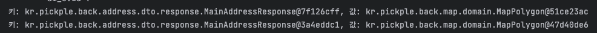

### 문제 상황

**MapService.java**

```java
@Service
@RequiredArgsConstructor
public class MapService {

    private final MapPolygonRepository mapPolygonRepository;

    @Transactional(readOnly = true)
    @Cacheable(cacheManager = "caffeineCacheManager", cacheNames = "polygon")
    public MapPolygon findMapPolygonByMainAddress(final MainAddressResponse mainAddressResponse) {
        return mapPolygonRepository.findByAddressDepth1AndAddressDepth2(
                mainAddressResponse.getAddressDepth1(),
                mainAddressResponse.getAddressDepth2()
        );
    }
}
```

위와 같이 코드를 작성했을 때 동일한 mainAddressResponse 값으로 보내도 캐시에서 조회되지않고 DB에 쿼리가 나가는 현상이 지속되었습니다.

### 문제 원인

**MapService.java**

```java
@Transactional(readOnly = true)
    @Cacheable(cacheManager = "caffeineCacheManager", cacheNames = "polygon")
    public MapPolygon findMapPolygonByMainAddress(final MainAddressResponse mainAddressResponse) {
				// Local Cache 안에 내용 확인해보기
				Cache cache = cacheManager.getCache("polygon");
        com.github.benmanes.caffeine.cache.Cache<Object, Object> nativeCache = (com.github.benmanes.caffeine.cache.Cache<Object, Object>)cache.getNativeCache();

        // 캐시의 모든 항목을 조회
        Map<Object, Object> cacheMap = nativeCache.asMap();

        // 캐시의 키와 값 출력
        for (Map.Entry<Object, Object> entry : cacheMap.entrySet()) {
            Object key = entry.getKey();
            Object value = entry.getValue();
            System.out.println("키: " + key + ", 값: " + value);
        }
				// 

        return mapPolygonRepository.findByAddressDepth1AndAddressDepth2(
                mainAddressResponse.getAddressDepth1(),
                mainAddressResponse.getAddressDepth2()
        );
    }
```

왜 안될까라는 생각에 로컬 캐시안에 정상적으로 저장되는지 확인해보고 싶었습니다. 위와 같이 Local Cache 안에 저장되는 캐시의 목록을 확인할 수 있도록 코드를 작성해보았습니다. API를 3번 요청해보았는데 마지막 3번째 요청에 2개의 캐시가 저장된 것을 확인해볼 수 있었습니다.



저는 분명 동일한 데이터를 넘겨받아서 저장한 것인데 왜 캐시에 없다고 판단하여 데이터베이스에서 데이터를 불러와 매번 호출할 때마다 저장하는 것일까요?

저는 그 이유를 스프링 공식 문서에서 찾을 수 있었습니다.

[Declarative Annotation-based Caching :: Spring Framework](https://docs.spring.io/spring-framework/reference/integration/cache/annotations.html#cache-annotations-cacheable-default-key)

> **Default Key Generation - Spring Cache Abstraction**
> 
> 
> Since caches are essentially key-value stores, each invocation of a cached method needs to be translated into a suitable key for cache access. The caching abstraction uses a simple `KeyGenerator` based on the following algorithm:
> 
> - If no parameters are given, return `SimpleKey.EMPTY`.
> - If only one parameter is given, return that instance.
> - If more than one parameter is given, return a `SimpleKey` that contains all parameters.
> 
> This approach works well for most use-cases, as long as parameters have natural keys and implement valid `hashCode()` and `equals()` methods. If that is not the case, you need to change the strategy.
> 
> To provide a different default key generator, you need to implement the `org.springframework.cache.interceptor.KeyGenerator` interface.
> 

위 내용은 Spring Cache의 기본 키 생성 전략인데요. 캐싱을 할 때 Key를 명시하지 않는 경우 매개변수의 hashCode를 이용해서 Key를 생성하는 것이죠! 그럼 저 MainAddressResponse는 객체이고 내부에 있는 값이 매번 같더라도 생성될 때마다 다른 HashCode를 갖기 때문에 객체 안의 값이 같더라도 다른 Key로 인식해서 불러오지 못한 것이었습니다!

### 해결 방법

해결 방법에는 여러가지가 있습니다. 예를 들어 해당 객체에서 hashCode를 Override해서 값이 동일할 때는 동일한 hashCode를 갖게 해주는 방법, 아니면 직접 key를 지정해주는 방법, 아니면 Key 생성 전략을 직접 만들어서 해당 Key 생성 전략 등 다양한 방법이 있습니다.

```java
@Service
@RequiredArgsConstructor
public class MapService {

    private final MapPolygonRepository mapPolygonRepository;

    @Transactional(readOnly = true)
    @Cacheable(cacheManager = "caffeineCacheManager", cacheNames = "polygon", key = "#mainAddressResponse.addressDepth2.name")
    public MapPolygon findMapPolygonByMainAddress(final MainAddressResponse mainAddressResponse) {
        return mapPolygonRepository.findByAddressDepth1AndAddressDepth2(
                mainAddressResponse.getAddressDepth1(),
                mainAddressResponse.getAddressDepth2()
        );
    }
}
```

위 코드에서는 해당 API를 요청할 때 클라이언트로부터 받는 값이 고유한 값이기 때문에 addressDepth2의 name을 키로 지정하여 동일한 name이 들어올 경우 캐싱된 데이터를 보낼 수 있도록 설정했습니다.

캐시에 대해서 제대로 알지도 못하는데 빨리 구현하려는 욕심에 오랜시간동안 트러블 슈팅했었던 것 같습니다. 어떠한 기술을 사용하기 전에는 꼭 그 기술에 대해서 먼저 공부해보고 적용하기!! 👍👍