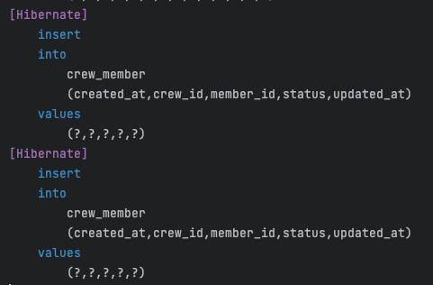

## 테스트 코드에서의 JPA 변경감지 동작 트러블 슈팅

### 문제 상황
``` java  
    public Crew save(final Member member) {
        final AddressDepth1 addressDepth1 = addressSetup.findAddressDepth1("서울시");
        final AddressDepth2 addressDepth2 = addressSetup.findAddressDepth2("영등포구");

        final Crew crew = CrewFixtures.crewBuild(addressDepth1, addressDepth2, member);

        crew.addCrewMember(member); // 크루의 멤버로 등록
        member.addMemberCrew(crew); // 멤버에 크루를 등록

        return crewRepository.save(crew);
    }

```
위 코드는 `Test Fixture`를 적용하기 위한 코드로 테스트 코드에서 작성된 코드입니다!

해당 프로젝트에서는 어떠한 crew(단체)를 만들 때 member를 매개변수로 넘겨 해당 crew의 crewMember가 되도록 해야하고, 반대로 crew(단체)를 만들 때 member에도 해당 member가 crew에 속해있다는 뜻으로 memberCrew가 추가 되어야합니다.

crew와 member 테이블 사이에 crew_member 테이블이 중간 테이블로 있으며 Crew와 CrewMember와 단방향으로 양방향 연관관계가 이루어져있고 Member와 CrewMember도 마찬가지로 단방향을 양방향 연관관계가 이루어져있습니다.

사실 위 코드는 잘못된 코드입니다. 왜냐하면 addCrewMember를 할 때마다 **아래와 같이** CrewMember를 새로 build해서 넣어주기 때문에
크루를 한 번 만들었는데 crew_member 테이블에 두번 등록이 되는 것이죠.

``` java
    private CrewMember buildCrewMember(final Crew crew, final Member member) {
        return CrewMember.builder()
                .member(member)
                .crew(crew)
                .build();
    }
```
### 문제 발생
잘못된 코드인 것을 알고 있었지만 이렇게 코드를 실행시켜보았을 때 `@Transactional` 이 붙은 테스트 코드에서 crew_member 테이블에 데이터 삽입이 한 번만 이루어지는 것을 확인해볼 수 있었습니다.

> 근데 `@Transacional`이 붙어있으면 기본적으로 롤백이 되는건데 삽입 쿼리도 안나가야하는거 아냐?
>

맞기도 하면서 틀리기도 합니다. `@Transactional`을 붙여서 삽입이 되는 경우는 기본키 전략을 Identity로 두었을 때 Auto Increment를 해서 ID값을 불러와야하는데 데이터베이스에 접근하지 않으면 불러올 수 없으므로 Insert를 날려 ID값을 불러오는 것 입니다. 

``` java
    public Crew save(final Member member) {
        final AddressDepth1 addressDepth1 = addressSetup.findAddressDepth1("서울시");
        final AddressDepth2 addressDepth2 = addressSetup.findAddressDepth2("영등포구");

        final Crew crew = CrewFixtures.crewBuild(addressDepth1, addressDepth2, member);

        crew.addCrewMember(member); // 첫번째, INSERT 나감
        member.addMemberCrew(crew); // 두번쨰, INSERT 안나감

        return crewRepository.save(crew);
```

> 그럼 위 코드에서 첫번쨰 코드는 INSERT문이 나가는데 왜 두번째는 INSERT문이 나가지 않는 것일까요?
>
현재 member 객체는 매개변수로 받아오고 있는 상태여서 member.addMemberCrew(crew)를 넘겨주게 되면 변경감지를 통해 INSERT문이 나가야하는 것이 맞습니다. 하지만 crew.addCrewMember(member)와 다르게 INSERT문이 나가지 않는 이유는 변경감지는 마지막에 트랜잭션이 끝나면서 flush를 하게되는데 트랜잭션이 끝나면서 롤백을 해야하기 때문에 flush를 할 필요가 없게되는 것 입니다.

> 아! 그럼 테스트코드가 아닌 로컬에서 API를 쏴보자! 그럼 INSERT문이 나가는지 보면 되지 않을까?
>

맞습니다. 실제로 로컬에서 API를 쏘게되면 두번 저장이되는 것을 확인해볼 수 있었습니다. 



### 결론
`@Transactional`을 테스트코드에서 사용하게되면 변경감지에 따른 `UPDATE, INSERT, DELETE`의 경우 트랜잭션이 끝날 때 동작하게 되는데 flush를 하지 않아 작동하지 않는 것입니다.
