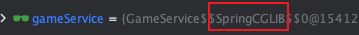
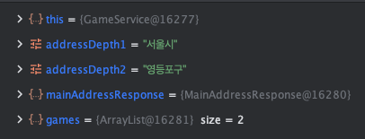
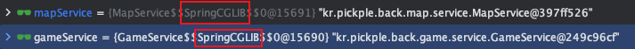

## Self Invocation 해결하기

### 문제 상황

**GameService.java**

```java
@Transactional(readOnly = true)
public GamesAndLocationResponse findGamesWithInAddress(
            final String addressDepth1,
            final String addressDepth2
 ) {
        final MainAddressResponse mainAddressResponse = addressService.findMainAddressByNames(addressDepth1,
                addressDepth2);

        final List<Game> games = gameRepository.findGamesWithInAddress(
                mainAddressResponse.getAddressDepth1(),
                mainAddressResponse.getAddressDepth2()
        );

        final MapPolygon polygon = **getMapPolygon(mainAddressResponse); // AOP 내부에서 @Cacheable 호출**

        final List<GameResponse> gameResponses = games.stream()
                .map(game -> GameResponse.of(game, getMemberResponses(game, CONFIRMED)))
                .toList();

        return GamesAndLocationResponse.of(gameResponses, polygon);
}

@Cacheable("polygon") // Self Invocation 문제로 동작 안함
public MapPolygon getMapPolygon(final MainAddressResponse mainAddressResponse) {
     return mapPolygonRepository.findByAddressDepth1AndAddressDepth2(
                mainAddressResponse.getAddressDepth1(),
                mainAddressResponse.getAddressDepth2()
     );
}
```

위와 같이 getMapPolygon을 호출했을 때 `@Cacheable`이 동작하지 않는 현상이 발생했습니다.

### 문제 원인

원인은 **Self Invocation이었습니다.**

> **Self Invocation 이란?**
프록시 객체에서 **내부 호출**을 하는 경우를 말합니다.
> 

위 코드에서는 왜 **Self Invocation**이 일어나는걸까요?

코드에서 보면 findGamesWithInAddress 메서드는 `@Transactional` 이 붙어있는 것을 보실 수 있습니다. 이 어노테이션은 Spring AOP를 기반으로 만들어진 어노테이션인데요. 트랜잭션이 필요한 모든 메서드에 트랜잭션 관련한 로직을 넣지않고 비지니스 로직에서 분리하기 위한 방법 중 하나입니다. 이것을 결국 횡단관심사의 분리라고 얘기하는데 이것을 **Spring AOP**라고도 볼 수 있습니다.

근데 이 Spring AOP가 프록시 패턴의 구현체, 프록시 객체를 이용하게 되는데 `@Transaction`이 붙은 메서드를 실행하기 위해 프록시 객체가 생성되고 호출시 프록시 객체 내부로 진입하게 됩니다. 아! 여기서 짚고 넘어가야할 점은 getMapPolygon 메서드 위에 붙어 있는 `@Cacheable` 도 Spring AOP를 기반으로 동작합니다. 그럼 `@Transactional` 메서드가 호출될 때 프록시 객체를 통해 접근하고 해당 메서드 내부에서 `@Cacheable` 을 호출할 경우 프록시 객체를 통해 접근하는 것이 아닌 내부 클래스 내에서 메서드 호출로 동작하여 AOP로 설정된 기능들이 동작하지 않는 것이죠!

1. Controller에서 gameService.findGamesWithInAddress 메서드를 호출 할 때
    
    
    
    - SpringCGLIB 프록시 객체로 호출되는 것을 확인해볼 수 있습니다.
2. getMapPolygon 메서드를 호출하는 라인에 BreakPoint를 걸었을 때
    
    
    
    - 내부 호출이기 때문에 프록시 객체를 통해서 접근하지 않는 것을 확인해볼 수 있습니다.

### 해결 방법

직접 프록시 객체를 주입 받아서 메서드를 호출하거나, CacheManager를 직접 불러와 구현하는 방법도 있지만 다른 클래스로 빼서 해당 클래스를 프록시 객체로 만들어 외부에서 호출하도록 했습니다. 외부에서 호출하는 경우 결국 내부 호출이 아니어서 프록시 객체를 통해서 접근하게될테니까요!

**GameFacadeService.java**

```java
@Component
@RequiredArgsConstructor
public class GameFacadeService {

    private final GameService gameService;
    private final MapService mapService;
    private final AddressService addressService;

    public GamesAndLocationResponse findGamesWithInAddress(
            final String addressDepth1,
            final String addressDepth2
    ) {
        final MainAddressResponse mainAddressResponse = addressService.findMainAddressByNames(addressDepth1,
                addressDepth2);

        final List<GameResponse> gameResponses = gameService.findGamesWithInAddress(mainAddressResponse);
        final MapPolygon mapPolygon = mapService.findMapPolygonByMainAddress(mainAddressResponse);

        return GamesAndLocationResponse.of(gameResponses, mapPolygon);
    }
}
```

원래는 GameService와 MapRepository 사이의 중간 Repository를 하나 만들어서 분리했었는데 GameService와 MapRepository 사이의 Repository가 좀 부자연스러워서 파사드 패턴을 이용해서 상단에서 하위 서브 기능들을 묶어주는 방식으로 구현했습니다.

**GameService.java**

```java
public List<GameResponse> findGamesWithInAddress(final MainAddressResponse mainAddressResponse) {
        final List<Game> games = gameRepository.findGamesWithInAddress(
                mainAddressResponse.getAddressDepth1(),
                mainAddressResponse.getAddressDepth2()
        );

        return games.stream()
                .map(game -> GameResponse.of(game, getMemberResponses(game, CONFIRMED)))
                .toList();
}
```

**MapService.java**

```java
@Service
@RequiredArgsConstructor
public class MapService {

    private final MapPolygonRepository mapPolygonRepository;

    @Transactional(readOnly = true)
    @Cacheable(cacheNames = "polygon")
    public MapPolygon findMapPolygonByMainAddress(final MainAddressResponse mainAddressResponse) {
        return mapPolygonRepository.findByAddressDepth1AndAddressDepth2(
                mainAddressResponse.getAddressDepth1(),
                mainAddressResponse.getAddressDepth2()
        );
    }
}
```



위 사진 처럼 FacadeService에서 2개의 메소드를 호출할 때 SpringCGLIB으로 된 프록시 객체를 탄다는 것을 확인할 수 있습니다.